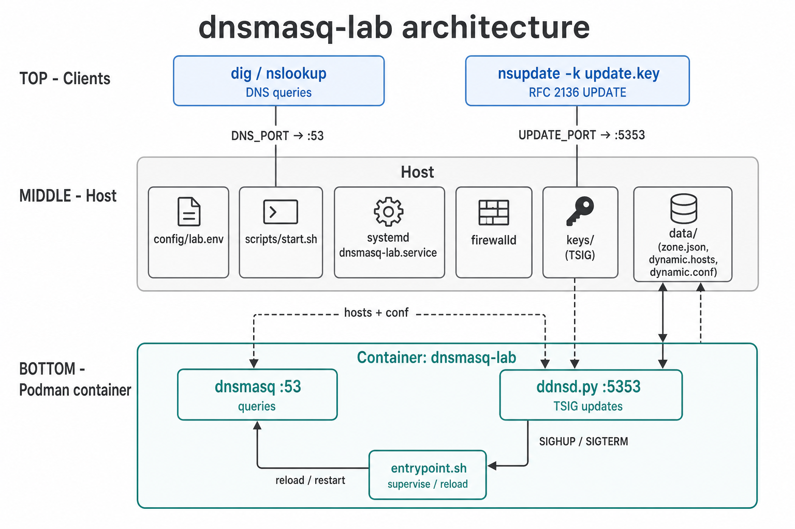
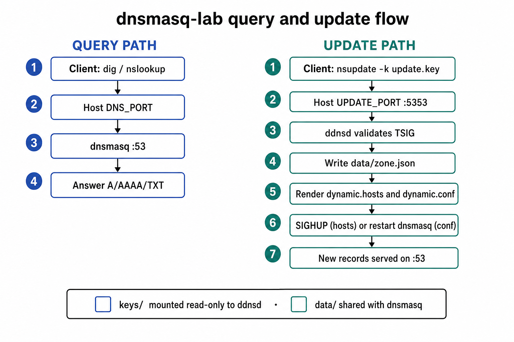

# dnsmasq-lab

## Disclaimer

This project or the binary files available in the `Releases` area are **not**
delivered and/or released by Red Hat. This is an independent project to help
deploy OCP/SNO environments where you have no control over DNS.

---

Podman lab that runs **dnsmasq** in a container and accepts external zone
updates with the real **`nsupdate`** tool, authenticated by a **TSIG key**.

Use it with [deploy-ocp](https://github.com/QikstAI/deploy_ocp) (or similar)
when provisioning SNO/OpenShift and you need local DNS that answers for your
cluster FQDNs.

dnsmasq does not speak RFC 2136 itself. This image pairs dnsmasq (queries on
`:53`) with a small companion, `ddnsd` (updates on `:5353`), that validates
TSIG, applies the UPDATE, rewrites dnsmasq config, and signals dnsmasq with
`SIGHUP` (or restarts it when the conf drop-in changes).

**Defaults** (from `config/lab.env`): zone **`example.com`**, addresses on
**`192.168.0.0/24`**, DNS port **`53`**, nsupdate port **`5353`**, upstream
**`1.1.1.1`** / **`8.8.8.8`**, TSIG key name **`update-key`**.

## Configure for your environment

Edit **`config/lab.env`** when your site uses a different domain or network.
For machine-local overrides that stay out of git, create
**`config/lab.local.env`** with the same keys.

```bash
# Example: change the domain (network matches config/lab.env defaults)
DDNS_ZONE=lab.example.com
LAB_CIDR=192.168.0.0/24
DDNS_GW_IP=192.168.0.1
DDNS_STATIC_IP=192.168.0.10
DDNS_NS1_IP=192.168.0.53

./scripts/stop.sh && ./scripts/start.sh
```

**Precedence (highest wins):** shell environment → `config/lab.local.env` →
`config/lab.env` → built-in defaults.

`LAB_CIDR` must be a `/24` (host `.0`). The lab derives:

| From | Derived |
|------|---------|
| `LAB_CIDR=192.168.0.0/24` | `LAB_PREFIX=192.168.0`, reverse `0.168.192.in-addr.arpa` |
| `DDNS_GW_IP=192.168.0.1` etc. | PTR host numbers (last octet: 1, 10, 53) |

Shell overrides still work without editing files, e.g.
`DNS_PORT=1053 ./scripts/start.sh`.

## Layout

```
dnsmasq-lab/
├── Containerfile
├── Makefile
├── config/
│   ├── lab.env           # domain / network / ports / upstream (edit this)
│   ├── lab.local.env     # optional local overrides (gitignored)
│   └── dnsmasq.conf      # dnsmasq template (${DDNS_ZONE}, …)
├── keys/                 # generated TSIG material (gitignored)
│   ├── update.key        # nsupdate -k
│   └── update.secret     # nsupdate -y (lab only)
├── data/                 # runtime zone state (gitignored except .gitkeep)
│   ├── zone.json
│   ├── dynamic.hosts     # A/AAAA (SIGHUP reload)
│   ├── dynamic.conf      # TXT/CNAME/PTR/wildcards (dnsmasq restart)
│   └── .firewalld-opened # ports recorded by start.sh
├── docs/
│   ├── architecture.png  # component diagram
│   └── flow.png          # query vs update flow
├── systemd/
│   └── dnsmasq-lab.service.in   # template for install-systemd.sh
├── mgmt-scripts/
│   ├── cleanup.sh
│   └── test.sh
└── scripts/
    ├── load-config.sh    # loads lab.env + derives defaults
    ├── prepare.sh        # key + empty data/
    ├── generate-tsig-key.sh
    ├── start.sh / stop.sh
    ├── install-systemd.sh
    ├── example-nsupdate.sh
    ├── ddnsd.py
    └── entrypoint.sh
```

## Prerequisites

- [Podman](https://podman.io/)
- Host tools: `nsupdate`, `dig` (`bind-utils` on RHEL/Fedora, `dnsutils` on Debian/Ubuntu)
- Optional: **systemd** (for boot management via `scripts/install-systemd.sh`)
- Optional: if **firewalld** is running, `./scripts/start.sh` opens
  `${DNS_PORT}` and `${UPDATE_PORT}` (tcp+udp) as **runtime** rules and records
  them in `data/.firewalld-opened`. `./mgmt-scripts/cleanup.sh` removes those
  ports from both **runtime and permanent** firewalld config (including the
  current values from `lab.env`).

## Quick start

**Manual (foreground lab session):**

```bash
./scripts/start.sh     # prepare + build + run (or: make start)
```

**Managed by systemd (starts at boot):**

```bash
sudo ./scripts/install-systemd.sh
sudo systemctl enable --now dnsmasq-lab.service
```

`start.sh` calls `prepare.sh` (creates the TSIG key and empty `data/` files if
needed), opens firewalld ports when applicable, builds the image, and starts
the container. The systemd unit runs the same `start.sh` / `stop.sh` path.

| Host port | Role |
|-----------|------|
| `53/tcp+udp` | DNS queries (dnsmasq) |
| `5353/tcp+udp` | Dynamic updates (`nsupdate`) |

If the host cannot bind port 53 (rootless Podman, or another resolver), remap
DNS only and leave updates on 5353:

```bash
DNS_PORT=1053 ./scripts/start.sh
dig @127.0.0.1 -p 1053 static.example.com +short
# nsupdate still uses: server 127.0.0.1 5353
```

## Query

```bash
dig @127.0.0.1 static.example.com +short
# 192.168.0.10

dig @127.0.0.1 -x 192.168.0.10 +short
# static.example.com.
```

When using a remapped `DNS_PORT`, pass `-p` to dig.

Static bootstrap names (from `lab.env`):

| Name | Address | PTR |
|------|---------|-----|
| `gateway.example.com` | `192.168.0.1` | `1.0.168.192.in-addr.arpa` |
| `static.example.com` | `192.168.0.10` | `10.0.168.192.in-addr.arpa` |
| `ns1.example.com` | `192.168.0.53` | `53.0.168.192.in-addr.arpa` |

## Update the zone with nsupdate + key

```bash
./scripts/example-nsupdate.sh
# or interactively:

nsupdate -k keys/update.key
> server 127.0.0.1 5353
> zone example.com.
> update add app.example.com. 300 A 192.168.0.80
> update add app.example.com. 300 TXT "hello-from-nsupdate"
> send
> quit

dig @127.0.0.1 app.example.com A +short
dig @127.0.0.1 app.example.com TXT +short
```

Inline secret (lab only):

```bash
nsupdate -y "$(cat keys/update.secret)"
```

Delete a record:

```bash
nsupdate -k keys/update.key <<'EOF'
server 127.0.0.1 5353
zone example.com.
update delete app.example.com. A
send
EOF
```

Supported update types: **A**, **AAAA**, **TXT**, **CNAME**, **PTR**.

| Type | Stored in | dnsmasq reload |
|------|-----------|----------------|
| A / AAAA (non-wildcard) | `data/dynamic.hosts` | `SIGHUP` |
| Wildcard A/AAAA, TXT, CNAME, PTR | `data/dynamic.conf` | process restart |

### Wildcards

Wildcard A/AAAA names (`*.apps.example.com`) become dnsmasq
`address=/apps.example.com/...` so queries like `foo.apps.example.com` resolve:

```bash
nsupdate -k keys/update.key <<'EOF'
server 127.0.0.1 5353
zone example.com.
update add *.apps.ocpcluster.example.com. 86400 A 192.168.0.101
send
EOF

dig @127.0.0.1 console-openshift-console.apps.ocpcluster.example.com +short
# 192.168.0.101
```

`nslookup` queries both A and AAAA. For wildcards, ddnsd also adds
`address=/…/::` so AAAA is `NOERROR` instead of `NXDOMAIN` (a dnsmasq quirk
when `local=/example.com/` is set). Prefer `dig` for clear A-only checks.

### Reverse (PTR)

A/AAAA entries in the lab `/24` are reverse-resolvable via the hosts file.
Explicit PTR updates use the reverse zone:

```bash
nsupdate -k keys/update.key <<'EOF'
server 127.0.0.1 5353
zone 0.168.192.in-addr.arpa.
update add 80.0.168.192.in-addr.arpa. 300 PTR app.example.com.
send
EOF
```

### OpenShift / SNO example

```bash
# config/lab.local.env
DDNS_ZONE=lab.example.com
LAB_CIDR=192.168.0.0/24
DDNS_GW_IP=192.168.0.1
DDNS_STATIC_IP=192.168.0.10
DDNS_NS1_IP=192.168.0.53
```

```bash
./scripts/start.sh

nsupdate -k keys/update.key <<'EOF'
server 127.0.0.1 5353
zone lab.example.com.
update add api.ocpcluster.lab.example.com. 86400 A 192.168.0.101
update add api-int.ocpcluster.lab.example.com. 86400 A 192.168.0.101
update add *.apps.ocpcluster.lab.example.com. 86400 A 192.168.0.101
send
EOF

dig @127.0.0.1 api.ocpcluster.lab.example.com +short
dig @127.0.0.1 console-openshift-console.apps.ocpcluster.lab.example.com +short
```

## Architecture



Clients talk to the Podman container through host ports. **Queries** hit
`dnsmasq` on **:53**; **updates** hit `ddnsd` on **:5353** with TSIG. Shared
volumes carry `keys/` (read-only) and `data/` (zone state + dnsmasq drop-ins).
`config/lab.env`, `scripts/start.sh`, systemd, and firewalld run on the host.

### Query vs update flow



## How it works

1. Client runs `nsupdate -k keys/update.key` against host port **5353**.
2. `ddnsd` verifies the TSIG signature; unsigned or wrong-key updates are refused.
3. Accepted changes are stored in `data/zone.json`, rendered to
   `data/dynamic.hosts` (A/AAAA) and `data/dynamic.conf` (TXT/CNAME/PTR/wildcards).
4. `ddnsd` sends `SIGHUP` for host-file changes, or **restarts** dnsmasq when the
   conf drop-in changes, so records are served on **:53**.

**Brief DNS gap:** TXT, CNAME, PTR, and wildcard updates rewrite `dynamic.conf`,
which dnsmasq only reads at process start. During that restart, queries can fail
for a fraction of a second. Prefer `dig` with a short retry, or wait until
`static.<zone>` answers again. Plain A/AAAA updates that only touch
`dynamic.hosts` use `SIGHUP` and do not restart.

## Stop

```bash
./scripts/stop.sh
# or: make stop
```

## systemd

Install a **oneshot** unit (`Type=oneshot`, `RemainAfterExit=yes`) that manages
the lab with your existing scripts:

| systemd action | Script |
|----------------|--------|
| `ExecStart` | `scripts/start.sh` |
| `ExecStop` | `scripts/stop.sh` |

The unit runs as **root** (port 53 / firewalld), after `network-online.target`
and `firewalld.service`. Template: `systemd/dnsmasq-lab.service.in`;
`install-systemd.sh` writes `/etc/systemd/system/dnsmasq-lab.service` with the
repo path filled in.

Scripts are started with `/usr/bin/bash …/scripts/start.sh` (not executed
directly) so SELinux allows the unit when the lab lives under `/root`
(`admin_home_t`).

```bash
# Install unit + prepare key/data
sudo ./scripts/install-systemd.sh

# Enable at boot and start now
sudo systemctl enable --now dnsmasq-lab.service

# Status and logs
systemctl status dnsmasq-lab.service
journalctl -u dnsmasq-lab.service -f

# Stop container (unit stays enabled for next boot)
sudo systemctl stop dnsmasq-lab.service

# After editing config/lab.env
sudo systemctl restart dnsmasq-lab.service

# Remove the unit
sudo ./scripts/install-systemd.sh --uninstall
```

While the unit is active, prefer `systemctl restart` / `stop` over running
`./scripts/start.sh` by hand so systemd stays in sync.

## Cleanup

Stops/disables and removes the systemd unit if installed, removes the
container, lab image, Alpine base image from the Containerfile, TSIG keys,
dynamic zone data, and firewalld rules for the lab DNS/update ports
(runtime + permanent):

```bash
sudo ./mgmt-scripts/cleanup.sh
# or non-interactive:
sudo ./mgmt-scripts/cleanup.sh -y
# or: make clean   # use sudo if the systemd unit was installed
```

Root/sudo is required when `dnsmasq-lab.service` is installed under
`/etc/systemd/system/` so cleanup can stop it and delete the unit file.

## Full test

Runs dependency checks, cleanup, start, **writes** the nsupdate add/delete
files under `data/`, applies them, and verifies with both **`dig`** and
**`nslookup`**. Honors `DNS_PORT` (and the rest of `lab.env`); nslookup uses
`-port=` when DNS is not on 53:

```bash
./mgmt-scripts/test.sh
DNS_PORT=1053 ./mgmt-scripts/test.sh
# or: make test
```

Artifacts written by the test:

- `data/nsupdate-forward.txt`
- `data/nsupdate-forward-delete.txt`
- `data/nsupdate-reverse.txt`
- `data/nsupdate-reverse-delete.txt`

CI runs the suite with `DNS_PORT=1053` so it does not fight systemd-resolved on
port 53; nsupdate stays on 5353.

Re-apply or remove those files manually:

```bash
nsupdate -k keys/update.key data/nsupdate-forward.txt
nsupdate -k keys/update.key data/nsupdate-reverse.txt
nsupdate -k keys/update.key data/nsupdate-forward-delete.txt
nsupdate -k keys/update.key data/nsupdate-reverse-delete.txt
```

## Make targets

| Target | Action |
|--------|--------|
| `make start` | prepare + start |
| `make stop` | stop/remove container |
| `make test` | full test suite |
| `make clean` | `cleanup.sh -y` |
| `make prepare` | key + empty `data/` |
| `make keys` | generate TSIG key only |
| `make logs` | `podman logs -f` |

## Notes

- Domain and network live in `config/lab.env` (see **Configure for your environment**).
- Keep `keys/update.key` private; anyone with it can change the lab zone.
- Regenerating the key: `FORCE=1 ./scripts/generate-tsig-key.sh`, then restart.
- Healthcheck: `podman healthcheck run dnsmasq-lab` (`start.sh` configures a
  dig-based check against `ns1.<zone>`).
